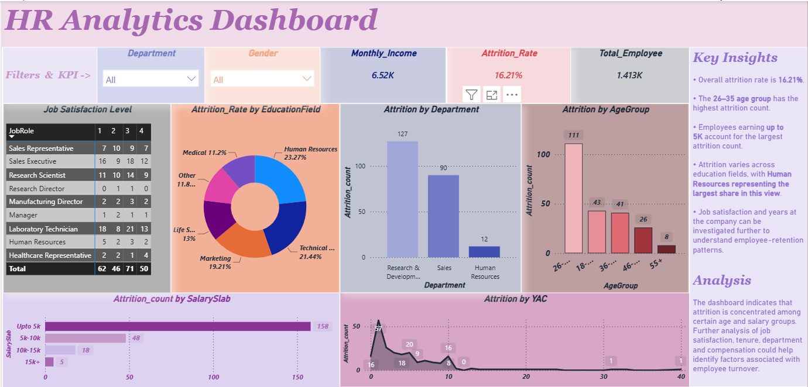

# 📊 HR Analytics Dashboard

An interactive Power BI dashboard designed to analyze employee attrition and identify patterns across departments, age groups, salary levels, education fields, tenure, and job satisfaction.

## 🎯 Business Problem

Employee attrition can affect workforce stability and increase recruitment and training requirements.

This project analyzes employee data to answer questions such as:

* What is the overall employee attrition rate?
* Which departments have the highest attrition count?
* Which age groups show the highest attrition?
* How does attrition vary across salary slabs?
* How does attrition differ across education fields?
* What patterns can be explored through job satisfaction and tenure?

## 🛠️ Tools & Technologies

* **Power BI**
* **DAX**
* **Power Query**
* **Microsoft Excel**
* **Data Visualization**
* **Business Analysis**

## 📸 Dashboard Preview

## 📌 Key KPIs

| KPI                    |  Value |
| ---------------------- | -----: |
| Total Employees        |  1,413 |
| Overall Attrition Rate | 16.21% |
| Monthly Income         |  6.52K |

## 🔎 Key Insights

### Age

The **26–35 age group** has the highest attrition count in the dashboard.

### Salary

Employees earning **up to 5K** account for the largest attrition count.

### Department

**Research & Development** has the highest attrition count among the departments shown.

### Education

The dashboard shows variation in attrition across education fields, with **Human Resources representing the largest share in this view**.

### Job Satisfaction & Tenure

Job satisfaction and years at the company can be investigated further to understand employee-retention patterns.

## 📈 Dashboard Features

* Department filter
* Gender filter
* Employee count KPI
* Attrition rate KPI
* Monthly income KPI
* Job satisfaction analysis by job role
* Attrition by education field
* Attrition by department
* Attrition by age group
* Attrition by salary slab
* Attrition by years at company

## 💡 Business Analysis

The dashboard indicates that attrition is concentrated among certain age and salary groups.

Further analysis of **job satisfaction, tenure, department and compensation** could help identify factors associated with employee turnover.

> Note: The dashboard presents descriptive patterns and associations. It does not establish that any individual factor directly causes employee attrition.

## 🧠 Skills Demonstrated

* Data visualization
* Dashboard design
* KPI development
* DAX
* Power BI
* Data analysis
* Business problem framing
* Insight communication

## 👨‍💻 Author

**Harsh**

Data Analyst | SQL | Power BI | Python | Excel

* Portfolio: https://harsh12103.github.io
* GitHub: https://github.com/harsh12103
* LinkedIn: https://linkedin.com/in/harsh-webdev
